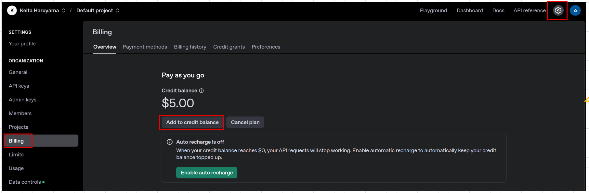
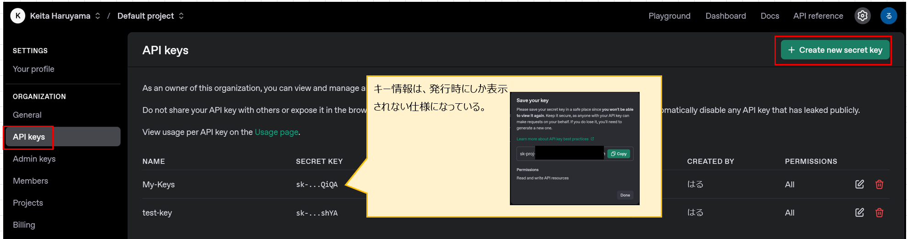
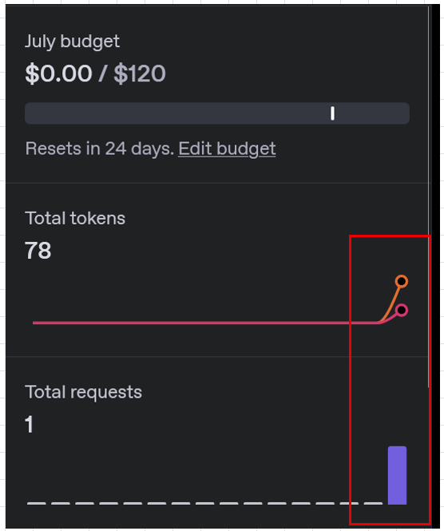

# はじめに
ChatGPTのAPI連携に関するハンズオン資料

# 目的
ChatGPTをWebブラウザ以外から活用する方法を学習する。
これにより、ブラウザ画面に縛られない、自由な開発体制の構築が可能となる。

# OpenAI APIページの活用

ChatGPTのAPIを活用するためには、OpenAI APIのページでAPIキーを発行する。
また、トークンの利用状況等もここで監視する。

[OpenAI API](https://platform.openai.com/docs/overview)

## トークンの購入
Setting→Billing画面より、トークンを購入する。


# 準備

## Python仮想環境の作成
```
sudo apt updata

sudo apt install python3.10-venv
```

Python仮想環境の作成

```
[実行コマンド]
python -m venv ai-venv

[確認コマンド]
ll

[結果]
drwxr-x--- 8 mainte mainte 4096 Jul  8 02:10 ./
drwxr-xr-x 3 root   root   4096 Jul  7 13:25 ../
drwxrwxr-x 6 mainte mainte 4096 Jul  8 02:08 ai-venv/
```

`ai-venv`仮想環境が作成された。

次に仮想環境をアクティベートする。

```
[ディレクトリを移動]
cd ai-venv2

[実行コマンド]
source ~/ai-venv2/bin/activate

[結果]
(ai-venv2) mainte@ai-machine:~/ai-venv2$ 
```

ちなみに停止の方法は`deactivate`コマンド

## 仮想環境にリポジトリをクローン

```
[実行コマンド]
git clone https://github.com/halchil/Generative-AI.git
```

## 仮想環境にパッケージをインストール
```
[実行コマンド]
pip3 list

[結果]
Package    Version
---------- -------
pip        22.0.2
setuptools 59.6.0
```

```
[実行コマンド]
pip3 install openai

[確認コマンド]
pip3 list

[結果]
Package           Version
----------------- ---------
annotated-types   0.7.0
anyio             4.9.0
certifi           2025.6.15
distro            1.9.0
exceptiongroup    1.3.0
h11               0.16.0
httpcore          1.0.9
httpx             0.28.1
idna              3.10
jiter             0.10.0
openai            1.93.1
pip               22.0.2
pydantic          2.11.7
pydantic_core     2.33.2
setuptools        59.6.0
sniffio           1.3.1
tqdm              4.67.1
typing_extensions 4.14.1
typing-inspection 0.4.1
```
OpenAI系のPythonライブラリがインストールされていることが分かった。

## APIキーの発行
ChatGPTのAPIキーを発行する。


# ChatGPTに投入する文書ファイルを作成

ユーザ情報を記入したファイルを準備する。
[info.txt](./info.txt)

ここでは、自分の名前情報を入れてある。

# Pythonファイルの作成

[チャット用Pythonファイル](./chat_with_file.py)
中にキー情報を入れておく。

```
[実行コマンド]
cd Generative-AI/ChatGPT_API/

[実行コマンド]
python3 chat_with_file.py 

[結果]
質問をどうぞ: こんにちは
AIの回答: こんにちは、Haruyamaさん。何かお手伝いできることがありますか？
```

なぜログインせずに使えるのか？
APIでは「APIキー」がユーザー認証の役割を果たしているから。

自分のAPIキー（例：sk-xxxxxxxx）が **「誰が呼び出しているか」**を識別する唯一の手がかりとなっている。

このキーは OpenAIのダッシュボードに紐づいたあなたのアカウントと連携しており、請求・使用状況・レート制限などを管理しています。

# トークン利用状況の確認

Setting→Usage画面に遷移すると利用状況を確認することができる。



# これから
